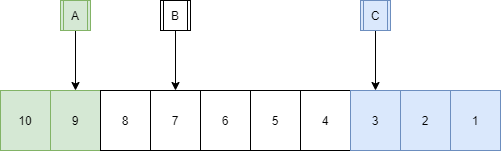

# Explanation:
The top elevator must service any user above its own floor, to guarentee minimum wait time.
Similarly the bottom elevator must service any user below its own floor, to guarentee minimum wait time.

Now, the problem is reduced to which floors the middle elevator has to service to optimize minimum wait time. 

We attempt to find if the topmost elevator services lower floors or the lowest elevator srvices higher floors will it reduce the minimum wait time.

In the above, example the maximum wait time for the floors 4 will be 5 unit time if the floors 8 to 4 are serviced only by elevator B. 
The program checks if floor 4 is serviced by C and floors 8 to 5 are serviced by B, then will it reduct the wait time. In this case the max wait time for floors 8 to 5 becomes 4 and the max wait time for floors 4 to 1 becomes 4 unit time. 
So we can see that the maximum wait time has reduced from 5 to 4 but a better solution is if A services floors 10 to 8, B services floors 7 to 4 and C services 3 to 1. In that case the wait times for A,B and C are 3, 3 and 2 respectively.

In this way the program checks and compares if the maximum wait time is reduced by moving the lower and upper bounds of the topmost and lowermost elevators.

*Assumptions:
 - Elevators only take 1 unit time in moving from one floor to  higher or lower floor.
 - It doesn't take time for a user to get onto a elevator.